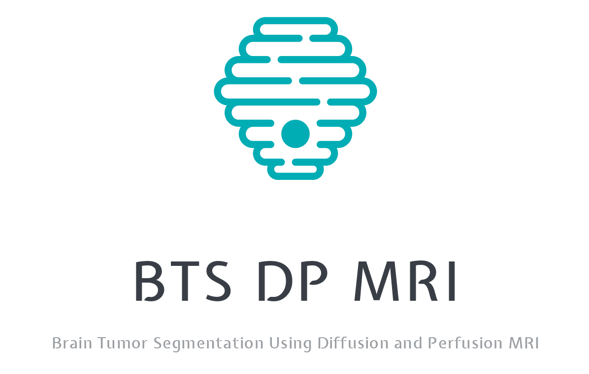

[](https://www.codefactor.io/repository/github/everlookneversee/bts_dp_mri)


## Authors
* Research: [Dr. Golestan Karami](https://www.linkedin.com/in/golestan-karami-45984938/)
* Development: [Milad Sadeghi DM](https://elns.ir)


## Sample Pipeline
**Pre-processing:**  
Desired dataset structure:  
```
.
└── Train
    ├── 100
    │   ├── mask_100.nii
    │   ├── MD_100.nii
    │   ├── rCBV_100.nii
    ├── 101
    │   ├── mask_101.nii
    │   ├── MD_101.nii
    │   ├── rCBV_101.nii
```
Do preprocessing on dataset:
```shell
python preprocessing.py --verbose --dataset <path to dataset directory>
```
This will create a new directory called *npy_files*, then creates specific folders for
each sample we have in dataset and saves *image.npy* and *mask.py* files in these folders.
```
npy_files/
├── 0
│   ├── mask_0.npy
│   └── image_0.npy
├── 1
│   ├── mask_1.npy
│   └── image_1.npy
```
**Training the model:**
```shell
python train.py --verbose --dataset <path to npy_files> --learning_rate 0.0001 --batch_size 2 --epochs 100 --save ./
```
After completing training process, command above will save trained model as a *.hdf5* file and display training process history.


## License
This project licensed under the MIT License - see the [LICENSE](LICENSE) file for more details.


## References
1. [Optimized U-Net for Brain Tumor Segmentation](https://arxiv.org/abs/2110.03352)
2. [Optimized High Resolution 3D Dense-U-Net Network for Brain and Spine Segmentation](https://www.mdpi.com/2076-3417/9/3/404)
3. [A novel fully automated MRI-based deep-learning method for classification of IDH mutation status in brain gliomas](https://pubmed.ncbi.nlm.nih.gov/31637430/)
